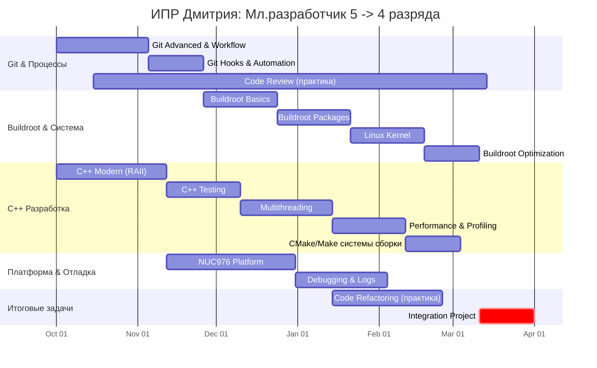

## **Индивидуальный план развития (ИПР) для Дмитрия**
**Сотрудник:** Младший разработчик ПО (С/С++) 5 разряда → Младший разработчик ПО (С/С++) 4 разряда  
**Период:** 6 месяцев (26 недель)  
**Цель:** Повышение уровня ключевых компетенций с "начального" на "средний"

---

### Ключевые компетенции для развития

Основываясь на вашем плане, можно выделить следующие ключевые компетенции, которые сотрудник будет целенаправленно развивать в течение 6 месяцев:

*   **Профессионально-технические компетенции**:
    *   **C++ Modern**: Глубокое понимание современных паттернов C++, включая RAII, умные указатели, семантику перемещения и многопоточность.
    *   **Системное программирование**: Навыки отладки (GDB), профилирования производительности (`perf`) и настройки ядра Linux для embedded-систем.
    *   **Инструменты сборки**: Практическое владение Buildroot для создания, кастомизации и оптимизации образов, а также знание CMake/Make для сборки проектов.
    *   **Работа с аппаратурой**: Умение работать с периферией микроконтроллера (NUC976) через даташиты и писать соответствующие драйверы.
    *   **Тестирование**: Навык написания модульных тестов с использованием Google Test и основ mocking.

*   **Процессные компетенции и работа в команде**:
    *   **Система контроля версий (Git)**: Продвинутое владение Git, включая работу с ветками, переписывание истории (rebase), разрешение конфликтов, использование hooks для автоматизации и эффективное участие в код-ревью.
    *   **Управление задачами**: Опыт реализации функциональности в рамках полного цикла разработки: от кодирования и тестов до оформления PR и получения обратной связи.

---

### **Детализированный план по спринтам**

| Спринт       | Сроки        | Категория                       | Конкретная задача                                      | Что надо знать по итогу                                                                                                                                                                                                                                                              | Практическое задание                                                                                                                                                                                                                                            | Источники изучения                                                                                                                                                                                                                                                                                                                                                                                                                                                                                                       |
| ------------ | ------------ | ------------------------------- | ------------------------------------------------------ | ------------------------------------------------------------------------------------------------------------------------------------------------------------------------------------------------------------------------------------------------------------------------------------ | --------------------------------------------------------------------------------------------------------------------------------------------------------------------------------------------------------------------------------------------------------------- | ------------------------------------------------------------------------------------------------------------------------------------------------------------------------------------------------------------------------------------------------------------------------------------------------------------------------------------------------------------------------------------------------------------------------------------------------------------------------------------------------------------------------ |
| **Спринт 1** | Недели 1-4   | **Git Advanced**                | Продвинутая работа с ветками                           | - git rebase -i, cherry-pick - Стратегии ветвления - Разрешение конфликтов                                                                                                                                                                                                     | Провести merge request со сжатием коммитов вручную, без графического инструмента GitLab. Потренировать отдельные переносы cherry-pick в момент объединения веток.                                                                                               | • **Книга "Pro Git" (русский перевод).** Главы **3 ("Ветвление")** и **7 ("Дополнительные инструменты Git")** — исчерпывающее руководство по работе с ветками, rebase и разрешению конфликтов. • **Интерактивный туториал "Learn Git Branching"**. Наглядное освоение ключевых концепций ветвления и слияния.                                                                                                                                                                                                         |
|              |              | **Buildroot Basics**            | Сборка кастомного образа                               | - make menuconfig, savedefconfig - Базовые пакеты и зависимости - Структура Buildroot                                                                                                                                                                                          | Собрать образ с включённым параметром gdb. Составить списко компонентов и параметров, которые включены в нашу сборку buildroot.                                                                                                                                 | • **Книга: "Встраиваемые системы на основе Linux" (К. Ягмур).** Главы **4-5** дают практическое введение в инструменты сборки, включая Buildroot, и создание корневой файловой системы. • **Официальная документация "Buildroot Manual"**. Первоисточник для понимания структуры и команд (`make menuconfig`, `savedefconfig`).                                                                                                                                                                                       |
|              |              | **C++ Modern**                  | Изучить RAII и умные указатели                         | - Отличие `unique_ptr` от `shared_ptr` - Практика использования вместо `new/delete`                                                                                                                                                                                               | Рефакторинг модуля: исследовать код на случаи ручного управления памятью и заменть их на умные указатели (хотя бы несколько случаев)                                                                                                                            | • **Книга "Эффективный современный C++" (Скотт Мейерс)**   - **Глава 4:** Умные указатели (`std::unique_ptr`, `std::shared_ptr`)   - **Глава 5:** Семантика перемещения и RValue-ссылки (важно для `std::unique_ptr`) • **Статья на GeeksforGeeks: "Smart Pointers in C++"**   - Разделы, посвященные `unique_ptr`, `shared_ptr` и `weak_ptr`, с примерами кода.   • **Metanit.com:** "Глава 5. Smart-указатели"                                                                                          |
| **Спринт 2** | Недели 5-8   | **Git Workflow**                | Работа в команде: PR, code review                      | - Создание качественных PR - Проведение code review - Работа с protected branches                                                                                                                                                                                              | Сделать 3+ PR с описанием изменений, провести 2+ code review                                                                                                                                                                                                    | • **Статья на Хабре: "Гайд по код-ревью" от Яндекс.Практикума.** Практические советы по проведению эффективного код-ревью и созданию качественных PR. • **"Code Review Checklist" на GitHub.** Стандартизирует процесс ревью, помогая не упустить важные аспекты.                                                                                                                                                                                                                                                     |
|              |              | **Buildroot Packages**          | Создание кастомного пакета                             | - Структура .mk файлов - Зависимости пакетов - Патчинг исходных кодов                                                                                                                                                                                                          | Рассмотреть возможность добавить в Buildroot утилиту для отладки проекта как кастомный пакет. К примеру gpio-debug (тестирование GPIO на устройстве)                                                                                                            | • **Книга "Встраиваемые системы на основе Linux" (К. Ягмур).** **Глава 6** посвящена созданию кастомных пакетов. • **Раздел "Adding packages" в "Buildroot Manual"**. Официальное руководство по структуре `.mk` файлов и зависимостям.                                                                                                                                                                                                                                                                               |
|              |              | **C++ Testing** (Basics)     | Настройка Google Test в проекте                        | - Структура тестового проекта - Написание `TEST()`, `TEST_F()` - Mocking базовых зависимостей                                                                                                                                                                                  | Написать 5+ unit-тестов для модуля батареи                                                                                                                                                                                                                      | • **Книга "Принципы юнит-тестирования" (В. Хориков).** Главы **1-3** дают прочную основу по написанию качественных unit-тестов. • **Статья на Хабре: "Unit-тесты на C++"**. Практическое введение в Google Test и основы mocking.                                                                                                                                                                                                                                                                                     |
| **Спринт 3** | Недели 9-13  | **Multithreading**              | Основы многопоточности в C++ (std::thread)             | - Создание и управление потоками - Базовые проблемы параллелизма                                                                                                                                                                                                                  | Изучить как по коды реализованы потоки, для чего они сделаны и как управляются. Рассмотреть возможность их улулчшения.                                                                                                                                          | • **Книга "C++ Concurrency in Practice" (Энтони Уильямс)**   - **Глава 2:** Управление потоками (`std::thread`, передача аргументов, присоединение/отсоединение).   - **Глава 3:** Разделение данных (состояния гонки, мьютексы `std::mutex`).   - **Глава 4:** Синхронизация одновременных операций (`std::lock_guard`, условные переменные). **Статья:** [C++ Multithreading](https://en.cppreference.com/w/cpp/thread)                                                                                    |
|              |              | **Code Refactoring**            | Базовый рефакторинг legacy-кода                        | - Выделение функций, устранение дублирования - Улучшение читаемости - Принципы чистого кода                                                                                                                                                                                    | Отрефакторить 2 проблемных модуля (уменьшение сложности на 25%): привести наименования переменных и названий функций к единосму стилю. Добавить комментарии к коду. Прийти к единому стилю автоформатирования clang-format (может перейти на версию от google). | • **Книга "Чистый код: создание, анализ и рефакторинг" (Р. Мартин).** Главы **1-4** (именование, функции, комментарии) и **6** (объекты и структуры данных) — фундамент для написания читаемого и поддерживаемого кода. • **Инструмент "Cppcheck"**. Статический анализатор для автоматического поиска проблем в коде.                                                                                                                                                                                                |
|              |              | **NUC976 Platform**             | Изучение периферии NUC976                              | - Регистры управления UART, GPIO - Работа с даташитом процессора - Тактирование и прерывания                                                                                                                                                                                   | Адаптировать модули GPIO и UART под C++ реализации. Ознакомиться с тем, как пишутся драйверы на плту NUC976 на обычном C.                                                                                                                                       | • **"NUC976 Technical Reference Manual" от Nuvoton.** Первоисточник по регистрам, периферии и архитектуре процессора. • **Примеры кода: "NUC976_Linux_Applications" на GitHub.** Практические образцы для работы с GPIO, UART и другими интерфейсами.                                                                                                                                                                                                                                                                 |
| **Спринт 4** | Недели 14-17 | **Linux Kernel**                | Конфигурация ядра для embedded                         | - Основные опции конфигурации - Модули ядра - Процесс компиляции                                                                                                                                                                                                               | Настроить и скомпилировать ядро для целевой платформы                                                                                                                                                                                                           | • **"Внутреннее устройство Linux" (ориг. "How Linux Works", Brian Ward).**  **Глава 5:** Загрузка ядра Linux – параметры ядра, процесс инициализации, анализ сообщений (с помощью journalctl и dmesg) • **Kernel Configuration docs**                                                                                                                                                                                                                                                                              |
|              |              | **Git Hooks & Automation**      | Автоматизация процессов                                | - Git hooks (pre-commit, pre-push) - Автоматические проверки - Интеграция с CI                                                                                                                                                                                                 | Настроить pre-commit hook для автоматического форматирования кода и проверку на cppcheck перед отправкой коммита                                                                                                                                                | • **Статья на Хабре: "Git Hooks на практике"**. Практическое руководство по настройке и использованию hooks для автоматизации. • **Репозиторий "git-hooks" на GitHub.** Коллекция примеров готовых скриптов.                                                                                                                                                                                                                                                                                                          |
|              |              | **Debugging & Logs**            | Отладка и анализ логов                                 | - Основы GDB/gdbserver - Команды GDB для embedded - Анализ dmesg, journalctl                                                                                                                                                                                                   | Найти и исправить 2 реальные проблемы: 1 через GDB, 1 через анализ логов                                                                                                                                                                                        | • **Книга "Искусство отладки" (русский перевод).** Главы **1-3** охватывают основные концепции и инструменты отладки, включая GDB. • **Статья на Хабре: "Отладка в Linux"**. Подробный обзор работы с GDB, `dmesg` и `journalctl` в среде Embedded Linux.                                                                                                                                                                                                                                                             |
| **Спринт 5** | Недели 18-21 | **Buildroot Optimization**      | Оптимизация размера образа                             | - Анализ размера пакетов - Удаление ненужных компонентов - Сжатие файловых систем                                                                                                                                                                                              | Понять из-за каких параметров и пакетов формируется размер проишвки. Понять что можно отключить, а что включить.                                                                                                                                                | • **Книга "Встраиваемые системы на основе Linux" (К. Ягмур).** **Глава 7** содержит методы и стратегии оптимизации размера системы. • **Инструмент "buildroot-size-stats"**. Скрипт для детального анализа размера пакетов в образе.                                                                                                                                                                                                                                                                                  |
|              |              | **Performance**                 | Профилирование кода                                    | - Инструменты `perf`, `top` - Анализ узких мест                                                                                                                                                                                                                                   | Найти и оптимизировать bottleneck в коде проекта                                                                                                                                                                                                                | **Статья:** [Linux Profiling](https://brendangregg.com/linuxperf.html) **Туториал:** [Perf Tutorial](https://perf.wiki.kernel.org/index.php/Tutorial)                                                                                                                                                                                                                                                                                                                                                                 |
|              |              | **Системы сборки (CMake/Make)** | Создание системы сборки для многофайлового C++ проекта | • Отличие Make (инструмент) от CMake (генератор). • Базовый синтаксис Makefile: цели, зависимости, команды. • Структура CMakeLists.txt: `cmake_minimum_required()`, `project()`, `add_executable()`. • Управление зависимостями между целевыми объектами (targets) в CMake. | 1. **Make**: Написать Makefile для сборки проекта из 2-3 `.c/.cpp` файлов в один исполняемый файл. 2. **CMake**: Сгенерировать тот же проект с помощью CMake, используя внешнюю сборку (out-of-source build).                                                | • **Книга "Встраиваемые системы на основе Linux" (К. Ягмур).** Может содержать практические примеры интеграции CMake в embedded-контексте. • **Официальный Tutorial CMake (Шаги 1-2).** Пошаговое руководство от создателей CMake, охватывающее основы и добавление библиотек. • **Руководство "Modern CMake".** Объясняет современные лучшие практики, ориентированные на целевые объекты (target-based). • **Статья "От GNU Make к CMake".** Дает сравнительное понимание обоих инструментов и их синтаксиса. |
| **Спринт 6** | Недели 22-26 | **Integration Project**         | Комплексная задача                                     | - Применение всех изученных навыков - Работа с Git в команде - Документирование результатов                                                                                                                                                                                    | Реализовать новый функционал с полным циклом разработки (PR, review, тесты)                                                                                                                                                                                     | • **Шаблон "Technical Report Template" на GitHub.** Поможет оформить результаты работы над финальным проектом.                                                                                                                                                                                                                                                                                                                                                                                                           |
|              |              | **Career Preparation**          | Подготовка к повышению                                 | - Самооценка по матрице компетенций - Сбор портфолио работ - Подготовка презентации                                                                                                                                                                                            | Составить отчет о достижениях с примерами кода и метриками                                                                                                                                                                                                      | • *"Матрица компетенций" RIT Automation*. Используется для самооценки и подготовки отчета о достижениях. • **Шаблон "Performance Review" на GitHub.** Может служить примером для структурирования презентации.                                                                                                                                                                                                                                                                                                        |

---

### Критерии успешного завершения ИПР

Для объективной оценки готовности к повышению до Мл. разработчика 4 разряда сотрудник должен продемонстрировать следующие результаты:

| Компетенция | Критерий успеха | Доказательства выполнения |
|-------------|-------------------|---------------------------|
| **Git & Процессы** | • Создано 5+ MR с качественными описаниями • Проведено 5+ код-ревью с конструктивными комментариями • Настроен pre-commit hook с clang-format и cppcheck | • Список принятых MR в GitLab • Примеры комментариев в код-ревью • Рабочий pre-commit скрипт в репозитории |
| **Buildroot & Система** | • Составлен полный список компонентов сборки • Создан кастомный пакет (gpio-debug) • Проведен анализ размера образа с предложениями по оптимизации | • Документ со списком компонентов • Рабочий пакет в Buildroot • Отчет по анализу размера с метриками |
| **C++ Modern** | • Рефакторинг 3+ модулей с заменой ручного управления памятью на умные указатели (по возможности) • Внедрение единого стиля кодирования (clang-format) | • Примеры кода "до/после" рефакторинга • Настроенный файл .clang-format в проекте |
| **C++ Testing** | • Написано 5+ unit-тестов для модуля батареи • Coverage > 70% для тестируемого модуля | • Тесты в репозитории • Отчет о покрытии кода |
| **Многопоточность** | • Проведен анализ существующих потоков • Предложены конкретные улучшения архитектуры | • Документ с анализом потоков • Список предложений по оптимизации |
| **Платформа NUC976** | • Адаптированы GPIO/UART модули под C++ • Изучены драйверы и принципы работы с периферией | • C++ реализации драйверов • Конспект по работе с даташитом |